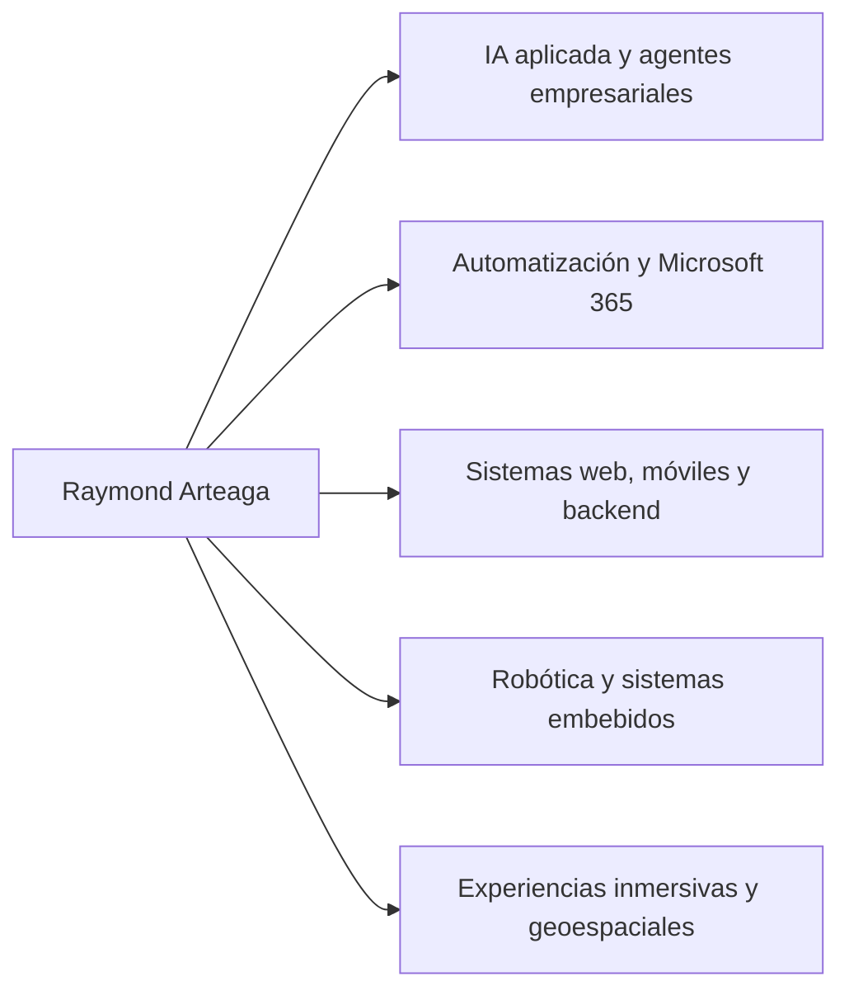

# Raymond Arteaga

### Ingeniero en Informática | IA aplicada, automatización, ingeniería de software y robótica

Diseño y construyo sistemas digitales que integran inteligencia artificial, automatización de procesos, datos, software y computación física.

[LinkedIn](https://www.linkedin.com/in/raymond-arteaga-7a6523308) ·
[UCABot](https://github.com/raymond311arteaga/ucabot-automated-delivery-system) ·
[Laboratorio de Innovación CAF](https://github.com/lab-innov) ·
[SILEX AI Consulting](https://github.com/silex-ai-consulting) ·
[Read in English](./README.md)

---

## Perfil profesional

Soy Ingeniero en Informática egresado de la Universidad Católica Andrés Bello, con experiencia en IA aplicada, automatización empresarial, desarrollo full-stack, robótica, sistemas embebidos y tecnologías inmersivas.

En el Laboratorio de Innovación de CAF he participado en agentes institucionales de IA, soluciones sobre Microsoft 365, marketplaces internos, automatizaciones operativas, formación digital, experiencias inmersivas e iniciativas de innovación. También soy fundador y Lead Developer de SILEX AI Consulting y autor de UCABot, mi Trabajo de Grado aprobado con mención honorífica.

## Áreas de trabajo

## Impacto seleccionado

| Área | Evidencia |
|---|---|
| IA aplicada | Participación en el diseño, desarrollo, evolución o despliegue de más de 30 iniciativas de agentes institucionales |
| Automatización empresarial | Soluciones con Copilot Studio, Power Automate, SharePoint, Excel, Office Scripts, Teams y Power BI |
| Tecnologías inmersivas | Participación en la virtualización de la sede CAF Caracas y en una experiencia del Maratón CAF 2026 utilizada por 3.456 personas |
| Robótica | Diseño e integración de UCABot en sus capas móvil, backend, edge, embebida y física |
| Reconocimiento académico | Trabajo de Grado de Ingeniería Informática defendido el 17 de julio de 2026 y aprobado con mención honorífica |
| Emprendimiento | Fundador y Lead Developer de SILEX AI Consulting |

## Experiencia profesional

### Laboratorio de Innovación CAF

Entre agosto de 2025 y julio de 2026 trabajé en iniciativas de IA aplicada, automatización, gestión del conocimiento e innovación inmersiva para distintas áreas institucionales.

Entre mis contribuciones representativas se encuentran:

- participación en más de 30 iniciativas de agentes institucionales;
- desarrollo del marketplace interno de agentes en SharePoint;
- automatizaciones end-to-end para pagos, contrataciones y horas adicionales;
- sesiones sobre Copilot, prompting, creación de agentes e IA responsable;
- virtualización de la sede CAF Caracas con Matterport y Captur3D;
- pruebas, documentación, publicación y soporte operativo con equipos de negocio y tecnología.

El perfil público de la organización se encuentra en [github.com/lab-innov](https://github.com/lab-innov). Sus repositorios operativos permanecen privados porque contienen trabajo institucional.

### SILEX AI Consulting

Fundé SILEX para desarrollar productos digitales, IA aplicada, automatización y experiencias web para organizaciones.

Proyectos públicos seleccionados:

- [SILEX Web](https://github.com/silex-ai-consulting/silex-web)
- [Cerámica Carabobo](https://github.com/silex-ai-consulting/ceramica-carabobo)
- [Arenera Solichiata](https://github.com/silex-ai-consulting/arenera-solichiata)

[Abrir la organización SILEX](https://github.com/silex-ai-consulting)

## Proyecto destacado

### UCABot — Sistema Automatizado de Reparto para Campus

Portafolio técnico bilingüe de un sistema ciberfísico distribuido que integra:

- aplicación Android en Flutter;
- backend modular en NestJS y Firebase;
- agente de coordinación en Python sobre Raspberry Pi;
- firmware C/C++ para Arduino Mega;
- prototipo físico fabricado en PETG.

El Trabajo de Grado fue defendido el 17 de julio de 2026 y recibió mención honorífica.

[Abrir el portafolio técnico de UCABot](https://github.com/raymond311arteaga/ucabot-automated-delivery-system)

## Capacidades técnicas

| Dominio | Tecnologías y prácticas |
|---|---|
| IA aplicada y automatización | Copilot, Copilot Studio, Power Automate, SharePoint, Microsoft 365, Excel, Office Scripts, Power BI |
| Lenguajes | TypeScript, JavaScript, Python, Dart, C/C++, Java, C#, SQL |
| Web y backend | React, Next.js, Angular, NestJS, Node.js, .NET, REST, Swagger/OpenAPI |
| Móvil y nube | Flutter, Firebase Authentication, Firestore |
| Robótica y sistemas embebidos | Raspberry Pi, Arduino Mega, PlatformIO, GPS, encoders, sensores ultrasónicos, protocolos seriales |
| Datos y visualización | Leaflet, React Leaflet, GeoJSON, OpenStreetMap, Recharts |
| Tecnologías inmersivas | Matterport, Captur3D, Orbix 360 y SketchUp |
| Flujo de ingeniería | Git, GitHub, GitLab, GitFlow, ramas feature, pull requests, GitHub Actions, Jira, pruebas unitarias y end-to-end |

## Enfoque de ingeniería

Valoro:

- separación clara de responsabilidades;
- arquitecturas adecuadas a la escala real del problema;
- decisiones trazables y alcance técnico honesto;
- desarrollo incremental y mejora continua;
- soluciones comprensibles, mantenibles y demostrables.

## Dirección profesional

Me interesan oportunidades y colaboraciones relacionadas con:

- IA aplicada y agentes empresariales;
- automatización y transformación digital;
- arquitectura de software y productos full-stack;
- robótica y sistemas ciberfísicos;
- innovación que conecte software, hardware y datos.

## Contacto

- LinkedIn: [linkedin.com/in/raymond-arteaga-7a6523308](https://www.linkedin.com/in/raymond-arteaga-7a6523308)
- GitHub: [github.com/raymond311arteaga](https://github.com/raymond311arteaga)
- Laboratorio de Innovación CAF: [github.com/lab-innov](https://github.com/lab-innov)
- SILEX AI Consulting: [github.com/silex-ai-consulting](https://github.com/silex-ai-consulting)
