# Raymond Arteaga

### Informatics Engineer | Applied AI | Automation | Software Engineering | Robotics

I design and build practical systems that connect artificial intelligence, automation, software, data and physical computing.

[LinkedIn](https://www.linkedin.com/in/raymond-arteaga-7a6523308) · [UCABot](https://github.com/raymond311arteaga/ucabot-automated-delivery-system) · [CAF Innovation Lab](https://github.com/lab-innov) · [SILEX AI Consulting](https://github.com/silex-ai-consulting) · [Español](./README.es.md)

 

<picture>
  <source media="(prefers-color-scheme: dark)" srcset="./assets/profile-banner-dark.svg">
  <source media="(prefers-color-scheme: light)" srcset="./assets/profile-banner-light.svg">
  
</picture>

## Technology stack

&nbsp;&nbsp;
&nbsp;&nbsp;
&nbsp;&nbsp;
&nbsp;&nbsp;
&nbsp;&nbsp;
&nbsp;&nbsp;

  

&nbsp;&nbsp;
<picture>
  <source media="(prefers-color-scheme: dark)" srcset="https://cdn.simpleicons.org/nextdotjs/FFFFFF">
  <source media="(prefers-color-scheme: light)" srcset="https://cdn.simpleicons.org/nextdotjs/000000">
  
</picture>&nbsp;&nbsp;
&nbsp;&nbsp;
&nbsp;&nbsp;
&nbsp;&nbsp;
&nbsp;&nbsp;
&nbsp;&nbsp;

  

&nbsp;&nbsp;
&nbsp;&nbsp;
&nbsp;&nbsp;
<picture>
  <source media="(prefers-color-scheme: dark)" srcset="https://cdn.simpleicons.org/github/FFFFFF">
  <source media="(prefers-color-scheme: light)" srcset="https://cdn.simpleicons.org/github/181717">
  
</picture>&nbsp;&nbsp;

## Selected impact

<table>
<tr>
<td align="center" width="25%"><strong>30+</strong> institutional AI-agent initiatives</td>
<td align="center" width="25%"><strong>3,456</strong> uses of a Maratón CAF 2026 immersive experience</td>
<td align="center" width="25%"><strong>Honorable Mention</strong> Informatics Engineering thesis</td>
<td align="center" width="25%"><strong>5 integrated layers</strong> in the UCABot cyber-physical system</td>
</tr>
</table>

---

## Technical snapshot

  
  
  
  

  

| What I build | Representative technologies |
|---|---|
| 🤖 **Applied AI & enterprise agents** | Copilot, Copilot Studio, Python, prompting, responsible AI |
| ⚙️ **Automation & digital operations** | Power Automate, SharePoint, Microsoft 365, Excel, Office Scripts, Power BI |
| 💻 **Software systems** | TypeScript, React, Next.js, NestJS, Node.js, Flutter, Firebase, REST |
| 🗺️ **Data & geospatial experiences** | SQL, GeoJSON, Leaflet, React Leaflet, OpenStreetMap, Recharts |
| 🔧 **Robotics & embedded systems** | Raspberry Pi, Arduino Mega, C/C++, PlatformIO, GPS, encoders, serial protocols |

---

## Professional profile

I am an Informatics Engineer from **Universidad Católica Andrés Bello**, with experience in applied AI, enterprise automation, full-stack development, geospatial systems, robotics, embedded systems and immersive technologies.

My work spans institutional AI agents, Microsoft 365 solutions, operational automations, web and mobile products, data-driven experiences and cyber-physical systems. I am also the founder and Lead Developer of **SILEX AI Consulting** and the author of **UCABot**, my Honorable Mention thesis project.

---

## Professional work

### CAF Innovation Lab

From **August 2025 to July 2026**, I contributed to applied AI, automation, knowledge management and immersive innovation initiatives across multiple institutional areas.

My work included **30+ institutional AI-agent initiatives**, an internal agent marketplace in SharePoint, end-to-end automations for payments, contracting and additional-hours processes, Copilot and responsible-AI enablement, and immersive initiatives such as the virtualization of CAF's Caracas headquarters. A Maratón CAF 2026 immersive experience I helped deliver was used by **3,456 people**.

[CAF Innovation Lab on GitHub](https://github.com/lab-innov) — operational repositories remain private because they contain institutional work.

### SILEX AI Consulting

I founded **SILEX AI Consulting** to build digital products, applied-AI solutions, automation and web experiences for organizations.

[SILEX Web](https://github.com/silex-ai-consulting/silex-web) · [Cerámica Carabobo](https://github.com/silex-ai-consulting/ceramica-carabobo) · [Arenera Solichiata](https://github.com/silex-ai-consulting/arenera-solichiata) · [Organization](https://github.com/silex-ai-consulting)

---

## Featured project: UCABot

### Automated Campus Delivery System

**UCABot** is my Honorable Mention Informatics Engineering thesis and my main public technical project: a distributed cyber-physical system connecting mobile software, cloud services, edge computing, embedded firmware and a physical robot.

  

| Layer | Implementation |
|---|---|
| **Mobile** | Flutter Android application |
| **Backend** | NestJS and Firebase |
| **Edge** | Python coordination agent on Raspberry Pi |
| **Embedded** | C/C++ firmware on Arduino Mega |
| **Physical** | PETG robot prototype with GPS, encoders, ultrasonic sensors and servos |

The thesis was defended on **July 17, 2026** and received **Honorable Mention**.

[Explore the UCABot technical portfolio](https://github.com/raymond311arteaga/ucabot-automated-delivery-system)

---

## Technical capabilities

| Domain | Technologies and practices |
|---|---|
| **Applied AI and automation** | Copilot, Copilot Studio, Power Automate, SharePoint, Microsoft 365, Excel, Office Scripts, Power BI |
| **Languages** | TypeScript, JavaScript, Python, Dart, C/C++, Java, C#, SQL |
| **Web and backend** | React, Next.js, Angular, NestJS, Node.js, .NET, REST, Swagger/OpenAPI |
| **Mobile and cloud** | Flutter, Firebase Authentication, Firestore |
| **Robotics and embedded** | Raspberry Pi, Arduino Mega, PlatformIO, GPS, encoders, ultrasonic sensors, serial protocols |
| **Data and visualization** | Leaflet, React Leaflet, GeoJSON, OpenStreetMap, Recharts |
| **Immersive technologies** | Matterport, Captur3D, Orbix 360, SketchUp |
| **Engineering workflow** | Git, GitHub, GitLab, GitFlow, feature branches, pull requests, GitHub Actions, Jira, unit and end-to-end testing |
