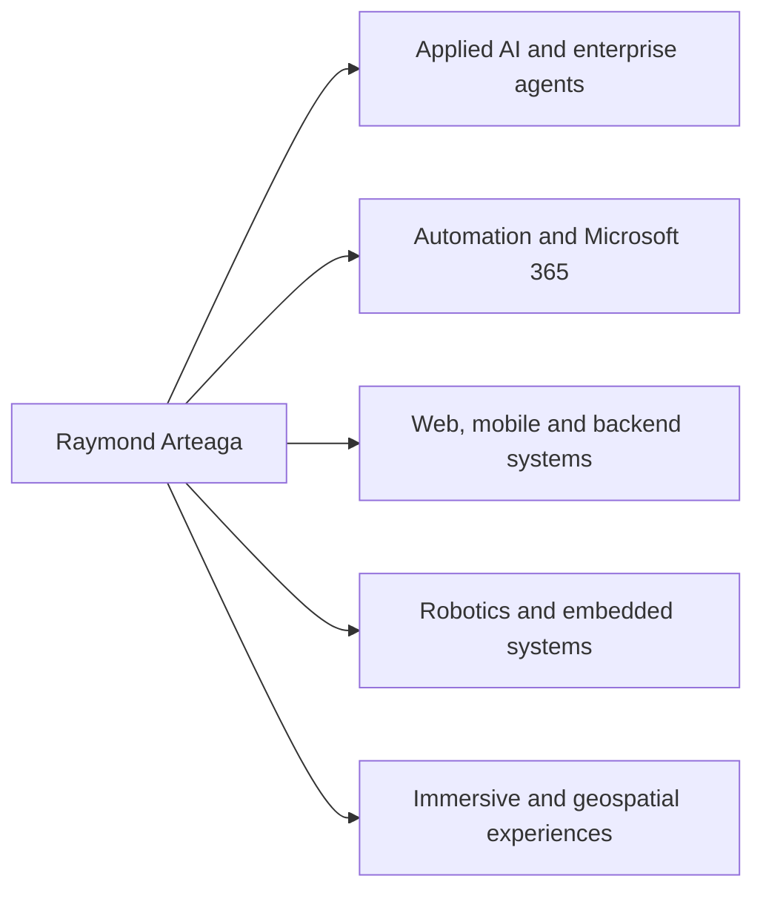

# Raymond Arteaga

### Informatics Engineer | Applied AI, Automation, Software Engineering and Robotics

I design and build practical digital systems that connect artificial intelligence, process automation, data, software and physical computing.

[LinkedIn](https://www.linkedin.com/in/raymond-arteaga-7a6523308) ·
[UCABot](https://github.com/raymond311arteaga/ucabot-automated-delivery-system) ·
[SILEX AI Consulting](https://github.com/silex-ai-consulting) ·
[Versión en español](./README.es.md)

---

## Professional profile

I am an Informatics Engineer from Universidad Católica Andrés Bello, with experience in applied AI, enterprise automation, full-stack development, robotics, embedded systems and immersive technologies.

My work has included institutional AI agents, Microsoft 365 solutions, internal marketplaces, operational automations, geospatial and immersive experiences, web products and the development of UCABot, my Honorable Mention thesis project.

## Areas of work

## Selected impact

| Area | Evidence |
|---|---|
| Applied AI | Contributed to the design, development, evolution or deployment of more than 30 institutional AI-agent initiatives |
| Enterprise automation | Built solutions with Copilot Studio, Power Automate, SharePoint, Excel, Office Scripts, Teams and Power BI |
| Immersive technologies | Contributed to the virtualization of CAF's Caracas headquarters and to an immersive Maratón CAF 2026 experience used by 3,456 people |
| Robotics | Designed and integrated UCABot across mobile, backend, edge, embedded and physical layers |
| Academic recognition | Informatics Engineering thesis defended on July 17, 2026 and awarded Honorable Mention |
| Entrepreneurship | Founder and Lead Developer of SILEX AI Consulting |

## Featured work

### UCABot — Automated Campus Delivery System

A bilingual technical portfolio for a distributed cyber-physical system that integrates:

- a Flutter Android application;
- a modular NestJS and Firebase backend;
- a Python coordination agent on Raspberry Pi;
- C/C++ firmware on Arduino Mega;
- a PETG physical robot prototype.

[Open the UCABot technical portfolio](https://github.com/raymond311arteaga/ucabot-automated-delivery-system)

### SILEX AI Consulting

SILEX is my technology organization for digital products, applied AI, automation and web experiences.

Selected public projects:

- [SILEX Web](https://github.com/silex-ai-consulting/silex-web)
- [Cerámica Carabobo](https://github.com/silex-ai-consulting/ceramica-carabobo)
- [Arenera Solichiata](https://github.com/silex-ai-consulting/arenera-solichiata)

[Open the SILEX organization](https://github.com/silex-ai-consulting)

## Technical capabilities

| Domain | Technologies and practices |
|---|---|
| Applied AI and automation | Copilot, Copilot Studio, Power Automate, SharePoint, Microsoft 365, Excel, Office Scripts, Power BI |
| Languages | TypeScript, JavaScript, Python, Dart, C/C++, Java, C#, SQL |
| Web and backend | React, Next.js, Angular, NestJS, Node.js, .NET, REST, Swagger/OpenAPI |
| Mobile and cloud | Flutter, Firebase Authentication, Firestore |
| Robotics and embedded | Raspberry Pi, Arduino Mega, PlatformIO, GPS, encoders, ultrasonic sensors, serial protocols |
| Data and visualization | Leaflet, React Leaflet, GeoJSON, OpenStreetMap, Recharts |
| Engineering workflow | Git, GitHub, GitFlow, feature branches, pull requests, GitHub Actions, unit and end-to-end testing |

## Engineering approach

I value:

- clear separation of responsibilities;
- architecture appropriate to the real scale of the problem;
- traceable decisions and honest technical scope;
- incremental delivery and continuous refinement;
- solutions that can be understood, maintained and demonstrated.

## Current direction

I am interested in roles and collaborations involving:

- applied AI and enterprise agents;
- automation and digital transformation;
- software architecture and full-stack product development;
- robotics and cyber-physical systems;
- innovation projects that connect software, hardware and data.

## Contact

- LinkedIn: [linkedin.com/in/raymond-arteaga-7a6523308](https://www.linkedin.com/in/raymond-arteaga-7a6523308)
- GitHub: [github.com/raymond311arteaga](https://github.com/raymond311arteaga)
- Organization: [github.com/silex-ai-consulting](https://github.com/silex-ai-consulting)
